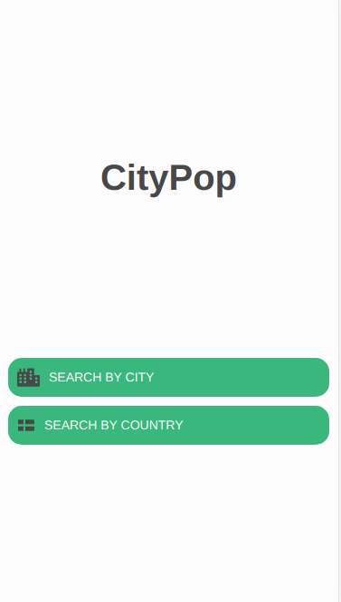

<div id="top"></div>
<!-- PROJECT SHIELDS -->
<!--
*** I'm using markdown "reference style" links for readability.
*** Reference links are enclosed in brackets [ ] instead of parentheses ( ).
*** See the bottom of this document for the declaration of the reference variables
*** for contributors-url, forks-url, etc. This is an optional, concise syntax you may use.
*** https://www.markdownguide.org/basic-syntax/#reference-style-links
-->


<!-- PROJECT LOGO -->

<!-- ABOUT THE PROJECT -->
## About The Project

<div align="center">
  <
</div>
<br/>

CityPop is an application in which the user can search for the population of cities around the world. This can be done in two ways:
* You can search for the city with the city name
* You can also search for a country. If you search for a country the 20 biggest cities in the country will be displayed. Then you can click on a city to see its
  population.
  
From every screen except for the home screen you can return back to an earlier screen by pressing the back button in the top left corner.
Every time a search is done the results are fetched dynamically from the API GeoNames.

<p align="right">(<a href="#top">back to top</a>)</p>


### Built With

* [React Native](https://reactnative.dev/)
* [Expo](https://docs.expo.dev/) - Used for building and testing the application for both mobile an web
* [Axios](https://axios-http.com/) - Used for fetching data from APIs through HTTP
* [Country List](https://www.npmjs.com/package/country-list) - Used for converting countries to their country codes
* [React Navigation](https://reactnavigation.org/) - Used for navigating between pages in React Native
* [GeoNames API](http://www.geonames.org/) - API with over eleven million placenames around the world
 

<p align="right">(<a href="#top">back to top</a>)</p>

<!-- GETTING STARTED -->
## Getting Started

This is an instruction to setting up the project locally.

### Prerequisites

Node and npm is needed to run React Native.

### Installation

Below is an example of how you can install and set up your app.

1. Open a terminal and clone the repo
   ```sh
   git clone https://github.com/HawkieOne/CityPop.git
   ```
2. Start a code editor and open the folder in whcih the project were cloned
3. Install NPM packages
  ```sh
   npm install
   ```
4. Start the project
  ```sh
   npm start
   ```
5. If you do not have Expo installed you will be asked to install it in step 4. Press y to install it

<!-- SMART SOULTIONS -->
## Smart Solutions

- The app has error handling. If the user does not have internet connection this is shown for the user and if the user searchs for an non-existing city this is 
  shown.
- If the user tries to search without entering a search term an error is shown
- If the user enter numbers or other characters than letters an error is shown
- If the user has spaces behind the search term the app removes the spaces and the search is successful
- The app uses SafeAreas through React Native to handle physical nothes on phones

<p align="right">(<a href="#top">back to top</a>)</p>

<!-- IMPROVMENTS -->
## Improvments

The app is far from perfect and has its flaws. The known ones are listed below.

- When searching for a city you can also search for a country. This will however show that the population in the country is zero. This bug is created with how 
  the call to the API is done. With better parameters to the API this bug can probably be avoided.
- Furthermore, it is also possible to search for places which are not cities. This is because of how to API returns its results and can probalby also be
  avoided with a better API call.
- When searching for a country the 20 biggest countries is shown. However, if the API only have ten cities with a population stored the rest of the list will
  consitst of other locations with a population of zero.
  
<!-- TESTED DEVICES -->
## Tested devices

* Xiaomi Mi 9 running Android
* Expo through Chrome dev tools with dimenesion iPhone SE
  
  
<p align="right">(<a href="#top">back to top</a>)</p>


<!-- LICENSE -->
<!-- ## License

Distributed under the MIT License. See `LICENSE.txt` for more information.

<p align="right">(<a href="#top">back to top</a>)</p> -->


<!-- CONTACT -->
## Contact

Håkan Lindahl - [/hakanlindahl](https://www.linkedin.com/in/h%C3%A5kan-lindahl-3a0427153/) - hakan.l.lindahl@gmail.com
<br />
Project Link: [https://github.com/HawkieOne/CityPop.git](https://github.com/HawkieOne/CityPop.git)

<p align="right">(<a href="#top">back to top</a>)</p>


<!-- MARKDOWN LINKS & IMAGES -->
<!-- https://www.markdownguide.org/basic-syntax/#reference-style-links -->
[contributors-shield]: https://img.shields.io/github/contributors/othneildrew/Best-README-Template.svg?style=for-the-badge
[contributors-url]: https://github.com/othneildrew/Best-README-Template/graphs/contributors
[forks-shield]: https://img.shields.io/github/forks/othneildrew/Best-README-Template.svg?style=for-the-badge
[forks-url]: https://github.com/othneildrew/Best-README-Template/network/members
[stars-shield]: https://img.shields.io/github/stars/othneildrew/Best-README-Template.svg?style=for-the-badge
[stars-url]: https://github.com/othneildrew/Best-README-Template/stargazers
[issues-shield]: https://img.shields.io/github/issues/othneildrew/Best-README-Template.svg?style=for-the-badge
[issues-url]: https://github.com/othneildrew/Best-README-Template/issues
[license-shield]: https://img.shields.io/github/license/othneildrew/Best-README-Template.svg?style=for-the-badge
[license-url]: https://github.com/othneildrew/Best-README-Template/blob/master/LICENSE.txt
[linkedin-shield]: https://img.shields.io/badge/-LinkedIn-black.svg?style=for-the-badge&logo=linkedin&colorB=555
[linkedin-url]: https://linkedin.com/in/othneildrew
[product-screenshot]: images/screenshot.png
